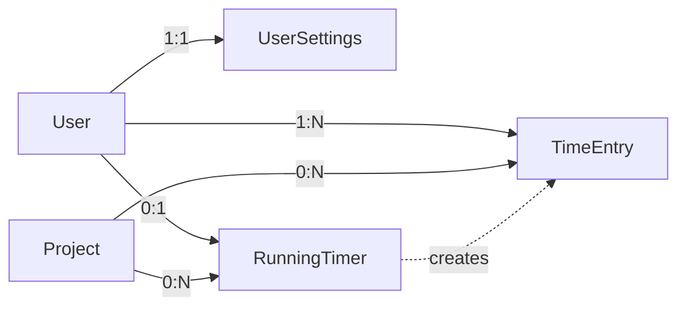

# Data Model: Timer Interruption System

## Entity Updates

### RunningTimer (Updated)
Tracks active timer sessions with interruption scheduling state.

**Fields**:
- `ownerId`: Id<"users"> - User who owns the timer
- `projectId`: Id<"projects"> - Associated project
- `startedAt`: number - Timestamp when timer started (ms)
- `lastHeartbeatAt`: number - Last client heartbeat timestamp (ms)
- `awaitingInterruptAck`: boolean - Whether interruption modal is showing
- `interruptShownAt`: number | null - Timestamp when modal was displayed (ms)
- `nextInterruptAt`: number | null - Next scheduled interruption check (ms)

**Indexes**:
- byOwner: ["ownerId"] - Find user's running timer
- byOwnerProject: ["ownerId", "projectId"] - Unique timer per user/project

**State Transitions**:
1. **Start**: Create with awaitingInterruptAck=false, calculate nextInterruptAt
2. **Heartbeat**: Update lastHeartbeatAt every 30 seconds
3. **Interrupt Triggered**: Set awaitingInterruptAck=true, interruptShownAt=now
4. **Interrupt Acknowledged (Continue)**: Reset awaitingInterruptAck=false, calculate new nextInterruptAt
5. **Interrupt Acknowledged (Stop)**: Delete record, create timeEntry
6. **Auto-Stop**: Delete record, create autoStop timeEntry + overrun entry

### TimeEntry (Updated)
Completed time records with source tracking for audit.

**Fields**:
- `ownerId`: Id<"users"> - User who owns the entry
- `projectId`: Id<"projects"> - Associated project
- `startedAt`: number - Start timestamp (ms)
- `stoppedAt`: number | null - Stop timestamp (ms)
- `seconds`: number | null - Total elapsed seconds
- `source`: "manual" | "timer" | "autoStop" | "overrun" - How entry was created
- `note`: string | null - Optional description
- `isOverrun`: boolean - Whether this is an overrun placeholder

**Validation Rules**:
- If source="overrun", isOverrun must be true
- If source="autoStop", isOverrun must be false
- seconds calculated as (stoppedAt - startedAt) / 1000
- stoppedAt required except for active overruns

### UserSettings (Existing)
User preferences for interruption behavior.

**Fields**:
- `userId`: Id<"users"> - User reference
- `interruptInterval`: 5 | 15 | 30 | 60 | 120 - Minutes between checks
- `interruptEnabled`: boolean - Whether interruptions are active

**Validation Rules**:
- interruptInterval must be one of allowed values
- Default: interruptEnabled=true, interruptInterval=30

## Relationships

## Data Integrity Rules

1. **Single Running Timer**: One RunningTimer per user maximum
2. **Overrun Pairing**: Each autoStop entry may have associated overrun entry
3. **Time Continuity**: No gaps between autoStop and overrun start times
4. **Heartbeat Staleness**: Timer invalid if lastHeartbeatAt > 5 minutes old
5. **Interrupt State Consistency**:
   - If awaitingInterruptAck=true, interruptShownAt must be set
   - If awaitingInterruptAck=false, interruptShownAt must be null

## Migration Requirements

For existing runningTimers records:
1. Add nextInterruptAt = startedAt + (userSettings.interruptInterval * 60000)
2. Set awaitingInterruptAck = false
3. Set interruptShownAt = null

For existing timeEntries:
1. Set source = "manual" for all existing entries
2. Set isOverrun = false for all existing entries